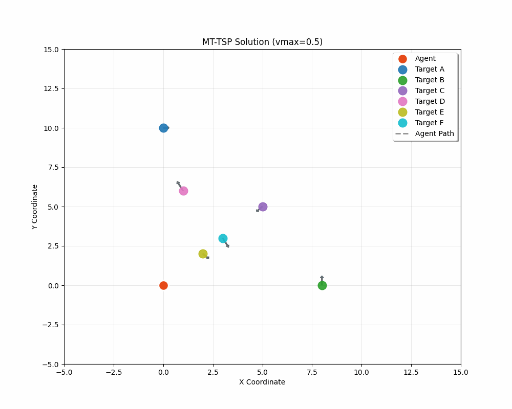

# MICP_for_MT-TSP

## Introduction

- This project aims for doing a small reprudocution and visualized demo of the **Section III** of the paper [A Mixed-Integer Conic Program for the Moving-Target Traveling Salesman Problem based on a Graph of Convex Sets](https://rap-lab.github.io/documents/publications/2024_IROS_MTTSP_MICP_Allen_cam.pdf).
- The following is a small gif demo:


## Getting Started

1. Clone this repo by `git clone https://github.com/Nuvole0217/MICP_for_MT-TSP.git`.
2. Install [Python>=3.9](https://www.python.org) and [pdm](https://pdm-project.org/en/latest/).
3. Change the directory into the repo, `cd MTCP_FOR_MT-TSP`.
4. Install dependencies by `pdm install && pdm run pre-commit install`.
5. Run the cli app by `pdm run app --help`.
6. Check other commands or scripts with `pdm run --list`.

### Run examples

- Run the following command to get the examples

```shell
cd examples
python3 examples.py
```

### Run the tests

- Run the following command to test the original code
- **Note:** You can create your own tests by editing the content of the `*.json` and `*.toml` files in `tests/run/complex` or `tests/run/simple`, note that sometimes you may not get feasible solutions.

```shell
cd tests
pytest
```

### How to use the scripts

- The cli command of the scripts takes two inputs, the first one is the relative path to the `*.json` file that stores the information of the targets, the second one is the relative path to the `*.toml` file that stores the information of the agent.

```shell
mt-tsp /path/to/your/json/file /path/to/your/toml/file
```

- For example, in the root directory of your project, you can run:

```shell
mt-tsp tests/run/complex/targets.json tests/run/complex/agent.toml
```

- **Note:** the scripts will output a `*.gif` files at **current directory**.
